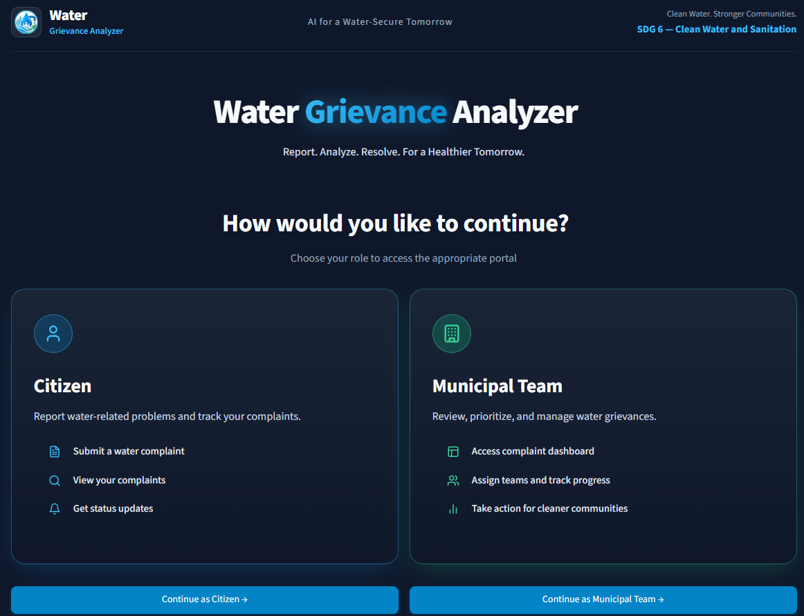
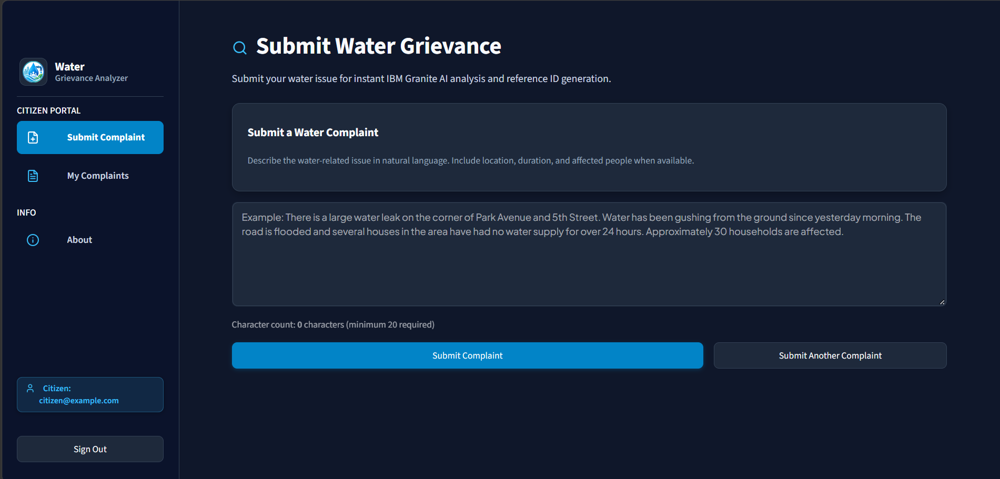
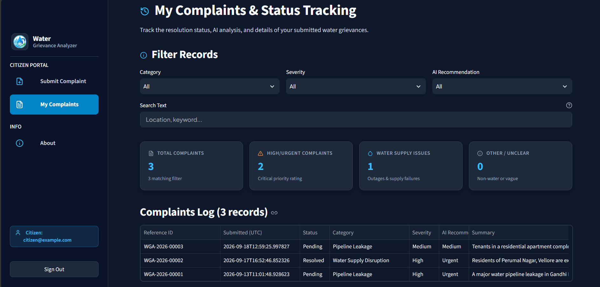
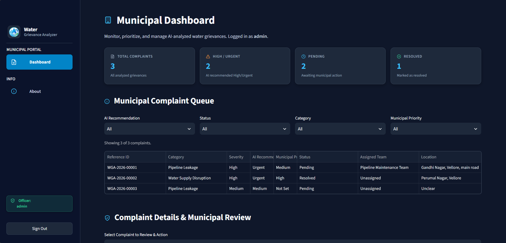
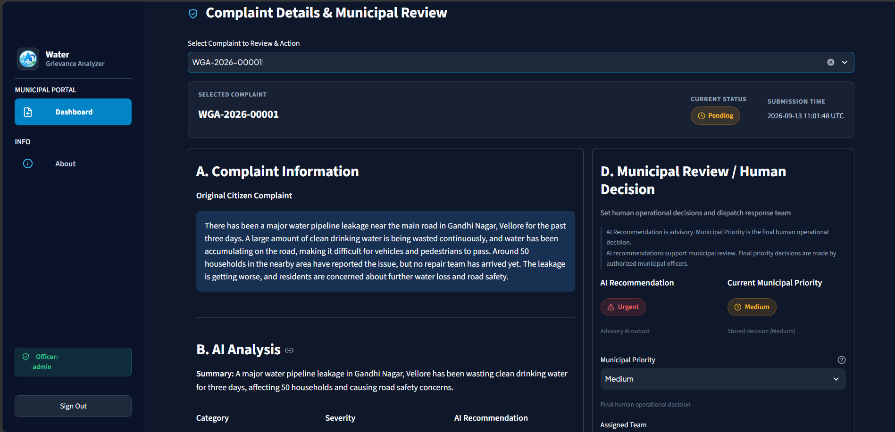
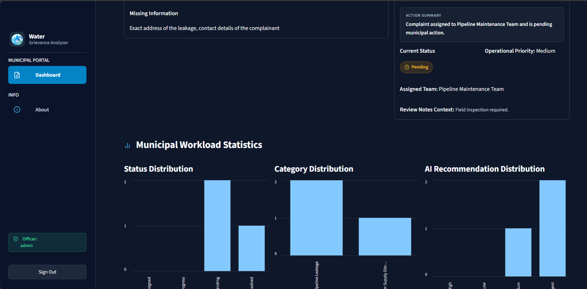

# 💧 AI-Powered Water Grievance Analyzer

> An AI-powered municipal decision-support system that turns unstructured citizen water complaints into structured, prioritized cases, while municipal officers keep the final say.


**[🔗 Live Demo](https://water-grievance-analyzer.streamlit.app/)** · **[📽️ Project Presentation](https://drive.google.com/file/d/1zPP6vCeYFePTdukSZxzvMUGVwt-8Sm_s/view?usp=sharing)** · **[🐞 Report an Issue](../../issues)**

---

## 📌 Project Overview

A Python/Streamlit prototype that accepts unstructured citizen water-related complaints, sends them to IBM's `ibm/granite-3-8b-instruct` model via the `ibm-watsonx-ai` SDK, and returns structured analysis for municipal human review. Every analysis result is persisted in a database (PostgreSQL on Neon for the deployed app, SQLite for local testing).

Built as part of the **1M1B (1 Million 1 Billion) AI for Sustainability Virtual Internship** in collaboration with **IBM SkillsBuild** and **AICTE**.

### The Problem

Municipal water authorities receive a high volume of unstructured citizen complaints (leaks, contamination, billing errors, access issues, etc.). Reading, sorting, and prioritizing them by hand is slow and error-prone, and critical details like the location or number of affected people get buried in long text. Urgent failures risk a delayed response.

### The Solution

This tool uses IBM Granite, a large language model hosted on IBM watsonx.ai, to automatically:

- **Summarise** the complaint in one plain-English sentence
- **Classify** it into one of five categories: Pipeline Leakage, Pipeline Failure, Water Supply Disruption, Low Water Pressure, or Other / Unclear
- **Assess severity**: Low, Medium, or High
- **Recommend a priority**: Low, Medium, High, or Urgent
- **Extract key facts**: location, duration, number of affected people
- **Identify missing information** that would help resolve the complaint

> ⚠️ **All AI outputs are recommendations only.** Final decisions must always be made by a qualified municipal authority.

---

## ✨ Features

### 👤 Citizen Portal
- Register / sign in with a citizen account
- Describe a water issue in plain language and get **instant AI analysis** and a **reference ID** (e.g. `WGA-2026-00001`)
- **My Complaints & Status Tracking:** filter by category, severity, and AI recommendation, or search by location or keyword
- **Record Inspector:** view the original complaint, AI summary, extracted details, key facts, and missing-information warnings
- Citizens only see **their own** complaints

### 🏛️ Municipal Portal
- Separate login for municipal officers and admins (role-based access control)
- **Dashboard** with live counts: total complaints, high/urgent, pending, resolved
- **Complaint queue** filterable by AI recommendation, status, category, and municipal priority
- **Complaint review** screen: original text, AI analysis, and extracted information side by side
- **Human decision panel:** set the final municipal priority, assign a response team, update the status, and add review notes
- **Workload statistics:** charts for status, category, and AI recommendation distribution

### 🤖 Responsible AI by Design
- **Human in the loop:** AI priority is advisory. The officer's *Municipal Priority* is stored separately as the final decision.
- **Hallucination prevention:** prompts forbid inventing details that aren't in the citizen's text. Unstated fields are labeled *Unclear*.
- **Missing info warnings:** highlights critical gaps (e.g. no street address) to avoid improper dispatch.
- **Safe parsing:** the response parser validates the JSON output, enums, and key facts array before anything is saved.

---

## 🖼️ Screenshots

| | |
|---|---|
| **Role selection**<br> | **Citizen: submit a complaint**<br> |
| **Citizen: status tracking**<br> | **Municipal: dashboard & queue**<br> |
| **Municipal: review & human decision**<br> | **Municipal: workload statistics**<br> |

---

## ⚙️ How It Works

```
Citizen submits complaint (plain text)
            ↓
Prompt builder → IBM Granite 3 8B Instruct (watsonx.ai)
            ↓
Response parser validates the JSON output
  → summary · category · severity · AI priority · key facts · missing info
            ↓
Result saved to the database with a reference ID
            ↓
Municipal officer reviews the queue
            ↓
Officer sets final priority, assigns a team, updates status
```

## 🎯 SDG 6 Context

**UN Sustainable Development Goal 6** calls for clean water and sanitation for all people by 2030. This project supports **Target 6.1** and **Target 6.B**: by speeding up municipal response to leaks and supply disruptions, it supports community participation in water management. Efficient triage is one concrete step toward that goal, ensuring that the most severe issues are escalated quickly and that no complaint is lost in an unmanaged inbox.

## 🛠️ Tech Stack

| Layer | Technology | Role |
|-------|-----------|------|
| Language model | IBM Granite (`ibm/granite-3-8b-instruct`) | Zero-shot complaint analysis and detail extraction |
| AI platform | IBM watsonx.ai (IBM Cloud) | Managed foundation model inference |
| SDK | `ibm-watsonx-ai` Python SDK | API authentication and text generation |
| App / backend | Python 3.9+ & Streamlit | Interactive web app and workflow management |
| Database | PostgreSQL (Neon) via `psycopg3` · SQLite for local testing | Persistent complaint log, users, and review history |
| Data processing | Pandas & JSON schema validation | Tabular aggregation and response validation |
| Version control | Git & GitHub | Source control |
| Deployment | Streamlit Community Cloud | Hosting |

---

## 🚀 Getting Started

### Prerequisites

- **Python 3.9 or later**
- **IBM Cloud account** with access to IBM watsonx.ai (a free trial is sufficient)
- `pip` for package installation
- *(Optional)* a Neon PostgreSQL database. Without one, you can run locally with SQLite.

### IBM watsonx.ai Setup

You will need three pieces of information from IBM Cloud:

1. **API Key**
   - Log in to [IBM Cloud](https://cloud.ibm.com)
   - Go to **Manage → Access (IAM) → API keys**
   - Click **Create an IBM Cloud API key**, give it a name, and copy the key value immediately (it is only shown once)

2. **Project ID**
   - Open [watsonx.ai](https://dataplatform.cloud.ibm.com/wx/home)
   - Create a project (or open an existing one)
   - Go to **Manage → General** inside the project
   - Copy the **Project ID** shown under "General"

3. **Regional URL**
   - Use the URL that matches the region where your watsonx.ai instance is provisioned
   - Common values:
     - `https://us-south.ml.cloud.ibm.com` (Dallas)
     - `https://eu-de.ml.cloud.ibm.com` (Frankfurt)
     - `https://jp-tok.ml.cloud.ibm.com` (Tokyo)

### Installation

```bash
# 1. Clone the repository
git clone https://github.com/KhursheedAhmed14/AI-Water-Grievance-Analyzer.git
cd AI-Water-Grievance-Analyzer

# 2. Create and activate a virtual environment (recommended)
python -m venv .venv
# On Windows:
.venv\Scripts\activate
# On macOS/Linux:
source .venv/bin/activate

# 3. Install dependencies
pip install -r requirements.txt

# 4. Configure credentials
cp .env.example .env
# Edit .env and fill in the values below

# 5. Run the app
streamlit run app.py
```

The app will open at `http://localhost:8501` in your browser.

### Configuration

```env
WATSONX_API_KEY=your_ibm_cloud_api_key
WATSONX_PROJECT_ID=your_watsonx_project_id
WATSONX_URL=https://us-south.ml.cloud.ibm.com
DATABASE_URL=your_neon_postgres_connection_string
```

> 🔒 **Never commit your `.env` file or any real keys.** It is listed in `.gitignore`. On Streamlit Community Cloud, add these values under **App settings → Secrets** instead.

### Running the tests

```bash
python -m pytest tests/
```

---

## 📁 Project Structure

```
AI-Water-Grievance-Analyzer/
├── app.py                        # Streamlit entry point (st.navigation role-aware landing & router)
├── pages/
│   ├── 1_Submit_Complaint.py     # Citizen Portal: Submit grievance & run IBM Granite AI triage
│   ├── 2_My_Complaints.py        # Citizen Portal: View own complaints & tracking status (filtered by citizen_id)
│   ├── 3_Citizen_Login.py        # Citizen Portal: Sign in / Register account
│   ├── 4_Municipal_Login.py      # Municipal Portal: Officer authentication
│   ├── 5_Municipal_Dashboard.py  # Municipal Portal: Queue, human review, team assignment (protected)
│   └── 6_About.py                # Public Info: SDG 6 context & system details
├── core/
│   ├── __init__.py
│   ├── auth.py                   # Role-aware authentication, session control & require_role guards
│   ├── database.py               # Database schema, user auth, citizen ownership, & complaint CRUD
│   ├── granite_client.py         # ibm-watsonx-ai SDK wrapper
│   ├── prompt_builder.py         # Structured prompt builder for Granite 3 8B Instruct
│   ├── response_parser.py        # Robust JSON response parser
│   ├── ui_icons.py               # Vector SVG icons
│   └── ui_theme.py               # Municipal dark theme tokens, CSS, & branding sidebar
├── config/
│   └── settings.py               # Env var configuration loader
├── tests/                        # Unit test suite
├── data/
│   └── grievances.db             # SQLite database for local testing (auto-initialized at runtime)
├── .env.example                  # Environment variable template
├── requirements.txt              # Python dependencies
└── README.md                     # Documentation
```

---

## 🔑 Demo Accounts

> These accounts exist **for demo purposes only** in this prototype. Do not reuse these passwords anywhere else.

| Role | Username / Email | Password |
|------|------------------|----------|
| Citizen | `citizen@example.com` | `citizen123` (or register a new citizen account) |
| Municipal Officer | `officer` | `water2026` |
| Municipal Admin | `admin` | `admin123` |

---

## ⚠️ Limitations

- AI output is a **recommendation** and can be wrong, so officer review is essential
- Analysis quality depends on how detailed the citizen's description is (location, duration, and number of affected people)
- Tested with sample complaints, not live municipal data
- Prototype-level authentication (see the disclaimer below)

## 🔮 Future Improvements

- Multilingual complaint support (e.g. Tamil)
- Map view of complaint locations
- Notifications to citizens when their complaint status changes
- Production-grade authentication and audit logging

---

## 📜 Disclaimer

This application is a **prototype** developed for educational and research purposes as part of the 1 Million 1 Billion (1M1B) AI for Sustainability Virtual Internship in collaboration with IBM SkillsBuild.

- AI-generated outputs are recommendations only and do not constitute official decisions.
- The app stores only the account details you register with (such as an email) and the complaint text you submit. Please use **sample or dummy data only**, and do not enter real personal information.
- It is not intended for production deployment without further security review, authentication, and validation.
- The developers make no warranty as to the accuracy of any AI-generated analysis.

---

## 👤 Author

**Muhammed Khursheed Ahmed N**
Final-year B.E. Computer Science and Engineering, C. Abdul Hakeem College of Engineering and Technology (CAHCET)

[GitHub](https://github.com/KhursheedAhmed14) · [LinkedIn](https://www.linkedin.com/in/muhammed-khursheed-ahmed)

## 🙏 Acknowledgements

- [1M1B](https://www.1m1b.org/) for the AI for Sustainability Virtual Internship
- IBM SkillsBuild and AICTE
- IBM watsonx.ai and IBM Granite
